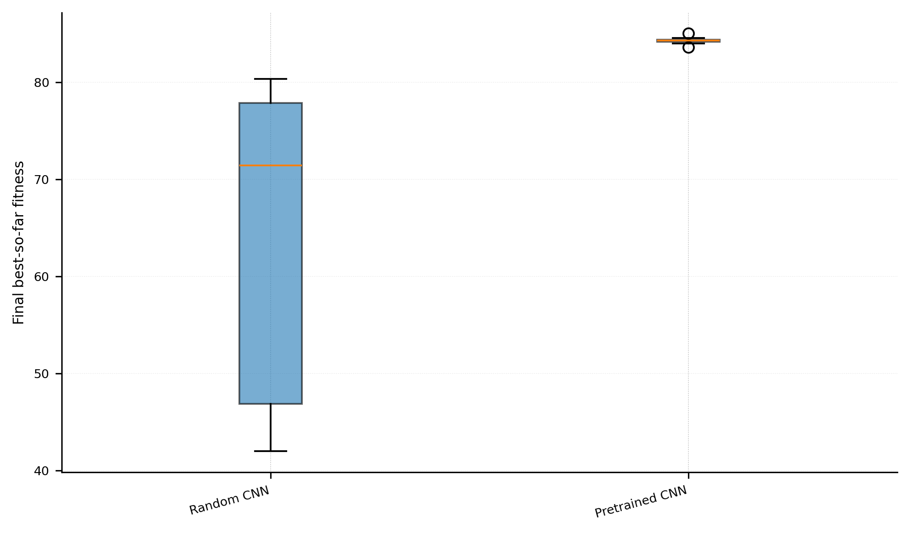
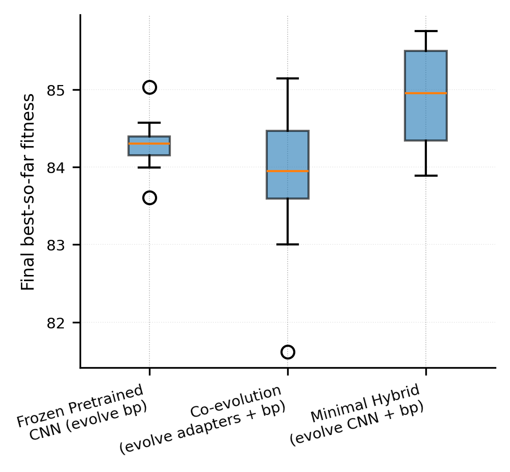
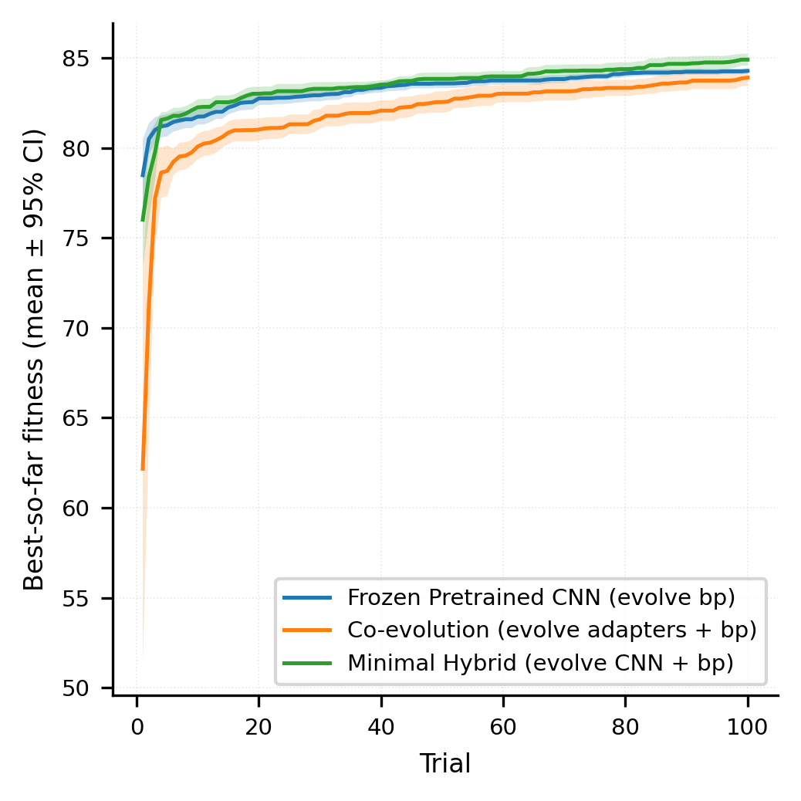

# Hybrid Genetic Algorithm for Autonomous Navigation

This repository contains the implementation and experimental pipeline of a thesis project on **genetic algorithms for autonomous navigation** using the DonkeyCar simulator.

The project investigates how different GA-based strategies perform when evolving a driving controller that combines:

- a lightweight CNN-based perception/controller model,
- bounded behavioral driving parameters,
- simulator-based fitness evaluation,
- staged ablation experiments,
- statistical comparison of evolved policies.

The main goal is not only to evolve a controller that drives in simulation, but to compare *which genetic representation and evolutionary strategy is actually useful* for autonomous navigation.

---

## Project Status

This is an active research/thesis repository. The current implementation contains the full simulator-based experimental pipeline for multiple GA stages, result analysis, plots, and exported genomes.

In addition to simulator evaluation, the best GA-evolved driver and a behavior cloning baseline were deployed on a physical DonkeyCar vehicle without real-world retraining. The GA driver showed partial sim-to-real transfer on an unseen real-world track, while the BC baseline failed almost immediately.

The project is suitable for research review and portfolio presentation.

---

## Real-World Transfer Videos

Both the GA-evolved driver and the behavior cloning (BC) baseline were trained entirely in the DonkeyCar simulator and then deployed on a physical DonkeyCar vehicle without real-world retraining.

In the physical test, the GA-evolved driver showed partial sim-to-real transfer on an unseen real-world track. In contrast, the BC baseline failed almost immediately after deployment. This provides initial qualitative evidence that the GA-evolved controller was more robust to the simulator-to-real-world gap than the supervised imitation-learning baseline.

The full demo videos are hosted externally to keep the repository lightweight.

| Controller | Training Environment | Real-World Retraining | Real-World Outcome | Demo |
|---|---|---|---|---|
| GA-evolved driver | DonkeyCar simulator | No | Partial transfer on unseen physical track | Available in demo folder |
| Behavior Cloning baseline | DonkeyCar simulator | No | Failed almost immediately | Available in demo folder |

### Demo Videos

[Open demo videos folder](https://drive.google.com/drive/folders/19Z8YVbfoxUw-4WE2k5eDehfX3oEVEa41?usp=drive_link)

### QR Code


---

## Base Framework and Dependencies


This project is built on top of the DonkeyCar autonomous driving platform.

Before running this repository, the user must first install DonkeyCar and set up the official DonkeyCar virtual environment by following the official installation guide:

https://docs.donkeycar.com/guide/install_software/#step-1-install-software-on-host-pc

All scripts in this repository are expected to be executed from an activated DonkeyCar environment, for example:

```bash
conda activate donkey
```

---

## What is original in this repository?

Original contributions:
- Custom genetic algorithm implementation
- CNN-weight and behavior-parameter genome representation
- Staged experimental design and ablation studies
- Fitness function design
- Statistical comparison scripts
- Exported GA-evolved drivers
- Sim-to-real evaluation on a physical DonkeyCar

External/base components:
- DonkeyCar simulator and vehicle software stack
- DonkeyCar application template
- DonkeyCar behavioral cloning baseline

---

## Research Question

Can a genetic algorithm improve autonomous navigation behavior by evolving both neural-network parameters and interpretable behavior parameters?

More specifically, the experiments compare:

1. randomly initialized CNN evolution,
2. pretrained/frozen CNN with evolved behavior parameters,
3. CNN adapter evolution,
4. co-evolution of adapters and behavior parameters,
5. direct hybrid evolution of CNN weights and behavior parameters,
6. stabilization mechanisms such as Hall of Fame, trimmed mean evaluation, and adaptive mutation,
7. fitness-function ablations.

---

## System Overview

The driving controller is represented as a genome. Each genome may contain:

- **CNN weights**: flattened neural-network parameters loaded into the controller,
- **behavior parameters**: bounded parameters affecting lane-following and preprocessing behavior,
- **controller parameters**: optional auxiliary policy parameters,
- **fitness metadata**: score assigned by simulator evaluation.

The controller uses a small CNN architecture designed for edge-map inputs and outputs steering/throttle commands. The evolutionary loop evaluates candidate genomes in DonkeyCar simulation and applies mutation, crossover, selection, and stage-specific mechanisms.

```text
Camera / simulator frame
        ↓
Preprocessing / edge features
        ↓
CNN controller + behavior parameters
        ↓
Steering / throttle command
        ↓
DonkeyCar simulator evaluation
        ↓
Fitness score
        ↓
Selection, mutation, crossover
```

---

## Repository Structure

```text
system_hybridGA/
├── src/
│   ├── controller.py       # CNN controller and driving policy logic
│   ├── genome.py           # Genome representation, bounds, mutation helpers
│   └── evolve_ga.py        # Main GA/evolution utilities and evaluation logic
│
├── scripts/
│   ├── ga_driver.py        # Evaluate/export a trained genome in simulation
│   ├── main_ga.py          # Main GA entry point / project script
│   └── exportBP.py         # Export behavior parameters from trials
│
├── comparisons/
│   ├── common_functions.py         # Shared simulator/config/evaluation utilities
│   ├── stage1_randomcnn.py         # Stage 1a: random CNN baseline
│   ├── stage1_pretrainedcnn.py     # Stage 1b: pretrained/frozen CNN baseline
│   ├── stage2_evolveCNN_only.py    # Stage 2a: adapter evolution only
│   ├── stage2_coevolution.py       # Stage 2b: adapters + behavior parameters
│   ├── stage3_minihybrid.py        # Stage 3: minimal hybrid CNN + BP evolution
│   ├── stage4_a.py                 # Stage 4a: trimmed mean + Hall of Fame
│   ├── stage4_b.py                 # Stage 4b: adaptive mutation variant
│   └── stage5_fitnessAblation.py   # Stage 5: fitness-function ablation
│
├── analysis/              # Statistical analysis and plotting scripts
├── results/               # Experiment outputs, summaries, and figures
├── genomes/               # Exported evolved genomes
├── requirements.txt
└── README.md
```

---

## Experimental Stages

| Stage | Variant | Purpose |
|---|---|---|
| Stage 1a | Random CNN | Baseline using randomly initialized CNN weights. |
| Stage 1b | Pretrained/Frozen CNN | Tests whether pretrained perception improves evolution. |
| Stage 2a | Evolve CNN adapters only | Evolves lightweight adapter parameters while keeping behavior parameters fixed. |
| Stage 2b | Co-evolution | Evolves adapters and behavior parameters together. |
| Stage 3 | Minimal Hybrid | Directly evolves CNN parameters and behavior parameters. |
| Stage 4a | Stabilized Hybrid | Adds trimmed mean evaluation and Hall of Fame. |
| Stage 4b | Adaptive Hybrid | Adds adaptive mutation on top of Stage 4a. |
| Stage 5 | Fitness Ablation | Compares alternative fitness definitions and their generalization behavior. |

---

## Key Results

The current experimental results show that pretrained perception and hybrid evolution are the most useful components in this setup.

### Final Best Fitness Summary

| Comparison | Baseline Mean | Variant Mean | Improvement | Statistical Result |
|---|---:|---:|---:|---|
| Stage 1: Random CNN → Pretrained CNN | 63.44 | 84.29 | +32.87% | Significant |
| Stage 2: Adapter-only → Adapter + BP co-evolution | 83.47 | 83.92 | +0.54% | Not significant |
| Stage 3: Co-evolution → Minimal Hybrid | 83.92 | 84.91 | +1.19% | Significant |
| Stage 4a: Minimal Hybrid → Stabilized Hybrid | 84.91 | 85.03 | +0.14% | Not significant |
| Stage 4b: Minimal Hybrid → Adaptive Hybrid | 84.91 | 85.10 | +0.23% | Not significant |





### Main Findings

- Pretrained/frozen perception strongly outperformed randomly initialized CNN evolution.
- Adapter + behavior-parameter co-evolution gave only a small, statistically non-significant improvement over adapter-only evolution.
- The minimal hybrid approach, evolving CNN parameters and behavior parameters together, produced a statistically significant improvement over adapter-based co-evolution.
- Stabilization mechanisms slightly improved average fitness, but the improvement was not statistically significant in the current runs.
- Fitness ablation experiments suggest that more complex fitness formulations may introduce trade-offs and do not automatically generalize better under clean evaluation.

The strongest current result is the Stage 3 minimal hybrid method, which achieved a better final best fitness than the Stage 2 adapter-based co-evolution setup.

---
## Baseline Comparison: GA vs. Bayesian Optimization (Vision-8, no CNN)

Separately from the staged hybrid experiments above, a smaller, simplified
comparison was run between the custom GA and a Bayesian Optimization (BO)
baseline (Optuna TPE), implemented in `comparisons/ga_baseline.py` and
`comparisons/baseline_optimizer.py`.

This comparison deliberately removes the CNN from the genome and uses the
8-dimensional Vision-8 behavioral/preprocessing parameter space (the same
`PARAM_KEYS` used elsewhere in the project), evaluated with a minimal
hand-crafted cross-track-error controller instead of a learned perception
model. The CNN was left out so that BO, which scales poorly to
high-dimensional search spaces, would not be handicapped relative to the GA
by the dimensionality of the problem alone.

Because this controller steers directly from the simulator-reported
cross-track error rather than from a processed camera image, only 4 of the
8 Vision-8 parameters actually affect the rollout: `lane_kp_off`,
`lane_kp_head`, `lane_kp_curv`, and `curv_thr_slow`. The remaining 4
(`lane_conf_thr`, `canny_scale`, `hough_threshold`, `diag_roi_row_start`)
are vision-preprocessing parameters with no effect here, since no edge
detection or CNN is in the loop; they are still sampled and logged for
schema consistency with the rest of the project, but the search both
optimizers are actually solving is effectively 4-dimensional, not 8.

Both optimizers were run with the same environment setup, parameter bounds,
evaluation budget (100 trials), and seeding convention, across three
different simulator tracks: the default DonkeyCar generated track, a
warehouse-style track, and the RoboRacingLeague track. Each optimizer/track
combination was run 15 times.

### Results

| Track | GA mean final fitness | BO mean final fitness | Higher mean | Statistical result |
|---|---:|---:|---|---|
| Generated track | 81.64 | 84.33 | BO (+3.2%) | Significant (p ≈ 0.038) |
| RoboRacingLeague | 97.43 | 97.95 | BO (+0.5%) | Significant (p ≈ 0.00003) |
| Warehouse | 130.89 | 123.88 | GA (+5.7%) | Significant (p ≈ 0.011) |

(Mann-Whitney U test, n=15 independent runs per optimizer per track; fitness
scale is not comparable across tracks, only within a track.)

### Main Findings (GA vs. BO): 
- BO had a statistically significant
  edge on two of the three tracks (generated, RoboRacingLeague), while the GA
  had a statistically significant edge on the third (warehouse).
- On the two tracks where BO ended up ahead, the GA still reached 90% of its
  own final best fitness in far fewer trials than BO did (roughly 4–6 trials
  vs. 15–21), suggesting the GA converges faster early on even on tracks
  where its final result is lower. On warehouse, where the GA's final result
  was higher, it also needed more trials to get there than BO did.
- This result should be read as a single low-dimensional, CNN-free
  comparison rather than a general claim about GA vs. BO performance; it
  does not extend to the full CNN + behavior-parameter genome used in the
  main staged experiments above.
---

## Installation

### 1. Clone the repository

```bash
git clone <repository-url>
cd system_hybridGA
```

## Simulator Setup

The experiments use the DonkeyCar simulator environment:

```text
donkey-generated-track-v0
```

Simulator connection settings are controlled through environment variables:

```bash
export SIM_HOST=127.0.0.1
export SIM_PORT=9091
```

For WSL2 or remote simulator setups, replace `SIM_HOST` with the simulator host IP.

The original development setup used a WSL-specific host address. For reproducible public usage, prefer explicitly setting `SIM_HOST` and `SIM_PORT` before running experiments.

---

## Running Experiments

All commands below use Python's `-m` module syntax and must be run from the
repository root (the `system_hybridGA/` directory created by `git clone`),
since the stage scripts use package-relative imports.

Common run configuration can be controlled with environment variables:

```bash
export K_REPEATS=5
export SEED=123
export RUN_ID=0
export EVAL_BUDGET=100
export POP=14
export MAX_STEPS=1000
export SIM_HOST=127.0.0.1
export SIM_PORT=9091
```

### Stage 1a: Random CNN baseline

```bash
python -m comparisons.stage1_randomcnn
```

### Stage 1b: Pretrained/Frozen CNN baseline

```bash
python -m comparisons.stage1_pretrainedcnn \
  --pretrained_json genomes/thebest_genome.json
```

### Export fixed behavior parameters

```bash
python scripts/exportBP.py \
  --trials path/to/trials.csv \
  --out fixed_bp.json \
  --mode fitness
```

### Stage 2a: Evolve CNN adapters only

```bash
python -m comparisons.stage2_evolveCNN_only \
  --pretrained_json genomes/thebest_genome.json \
  --fixed_bp_json fixed_bp.json \
  --sim_host "$SIM_HOST" \
  --sim_port "$SIM_PORT"
```

### Stage 2b: Co-evolution of adapters and behavior parameters

```bash
python -m comparisons.stage2_coevolution \
  --pretrained_json genomes/thebest_genome.json \
  --bp_init_json fixed_bp.json \
  --sim_host "$SIM_HOST" \
  --sim_port "$SIM_PORT"
```

### Stage 3: Minimal hybrid CNN + behavior-parameter evolution

```bash
python -m comparisons.stage3_minihybrid \
  --pretrained_json genomes/thebest_genome.json \
  --sim_host "$SIM_HOST" \
  --sim_port "$SIM_PORT"
```

### Stage 4a: Stabilized hybrid

```bash
python -m comparisons.stage4_a \
  --pretrained_json genomes/thebest_genome.json \
  --sim_host "$SIM_HOST" \
  --sim_port "$SIM_PORT"
```

### Stage 4b: Adaptive hybrid

```bash
python -m comparisons.stage4_b \
  --pretrained_json genomes/thebest_genome.json \
  --sim_host "$SIM_HOST" \
  --sim_port "$SIM_PORT"
```

### Stage 5: Fitness ablation

```bash
python -m comparisons.stage5_fitnessAblation \
  --pretrained_json genomes/thebest_genome.json \
  --sim_host "$SIM_HOST" \
  --sim_port "$SIM_PORT" \
  --fitness_mode f3
```

`--fitness_mode` selects which fitness formulation to evaluate (`f0`,
`f1`, `f2`, or `f3`; default `f2`). Run it once per mode to reproduce the
F0–F3 comparison described above.

---

## Evaluating an Exported Genome

A saved genome can be evaluated with:

```bash
python -m scripts.ga_driver \
  --genome genomes/thebest_genome.json \
  --host "$SIM_HOST" \
  --port "$SIM_PORT" \
  --episodes 20 \
  --max-steps 1000 \
  --out-csv eval_ga.csv
```

Supported control modes:

```bash
--control-mode hybrid
--control-mode polyfit_only
--control-mode cnn_only_steering
```

Add `--dynamic-lane-width` to enable measured-width steering gain scaling
(disabled by default; experimental, kept separate from the reproducible
thesis results).

---

## Results and Figures

Result summaries and plots are stored under `results/`.

Useful files include:

```text
results/stage1/perception/perception_final_summary.csv
results/stage1/perception/perception_stats_vs_baseline.csv
results/stage2/stage2_adapters/stage2_adapters_final_summary.csv
results/stage3/stage3_main_final_summary.csv
results/stage3/stage3_main_stats_vs_baseline.csv
results/stage4/mechanisms/mechanisms_final_summary.csv
results/stage5/_statistics_*.txt
```

Representative plots:

```text
results/stage1/perception/perception_final_boxplot.png
results/stage3/stage3_main_final_boxplot.png
results/stage3/stage3_main_evolution_ci.png
results/stage4/mechanisms/mechanisms_final_boxplot.png
results/stage5/_figures_clean_forward_progress/boxplot.png
```

---

## Analysis Scripts

The `analysis/` directory contains scripts for result processing, statistical comparison, and plotting:

```text
analysis/analyze_3.py
analysis/eval_correlation.py
analysis/plots_stage5.py
analysis/BOvsGA_analyze.py
```

These scripts are used to generate summary CSVs, statistical reports, and figures from the raw experiment outputs.

---

## Current Limitations

- **Termination asymmetry and metric choice.** Runs can differ in length depending on termination conditions and step limits. This biases duration-dependent secondary metrics, since an early-terminated run does not accumulate the same number of "bad" samples as a longer one. For this reason, completion rate was chosen as the primary metric. As a binary criterion, however, it compresses quality details: two drivers with the same completion rate can still differ in smoothness, oscillation, and lane deviation.
- **Sensitivity to track scale and width.** The system can transfer driving behavior to some new tracks but fails when track geometry changes substantially. A likely cause is that lane estimation (polyfit) and the evolved gains do not adapt sufficiently to scale changes (e.g. effective lane width in pixels); an experimental dynamic lane-width scaling mechanism exists in the codebase but is disabled by default and was not used for the reported results.
- **Sensitivity to fitness-function design.** Small changes to the terms or weights of the fitness function can substantially change system behavior. Added complexity does not guarantee improvement and can introduce conflicting incentives (e.g. progress vs. smoothness or safety), so fitness choices should be backed by systematic ablations rather than assumed.
- **Limited external validity.** Conclusions are specific to this DonkeyCar simulator setup, the selected tracks, and the chosen edge-based preprocessing. Transfer to a different simulator or track distribution may shift the observed trade-offs.
- Most quantitative experiments were conducted in the DonkeyCar simulator. The GA-evolved driver and a BC baseline were also deployed on a physical DonkeyCar without real-world retraining; the GA driver showed partial transfer on an unseen real-world track, while the BC baseline failed almost immediately. See [Physical Vehicle Transfer](#physical-vehicle-transfer) below.
- Some simulator configuration values depend on the local execution environment and should be set explicitly through environment variables or external configuration files.
- The repository is organized as a research-stage experimental codebase rather than a fully packaged Python library.
- The main GA implementation is still relatively monolithic and would benefit from modular refactoring into separate components for population management, genetic operators, fitness evaluation, simulator interaction, logging, and analysis.
- Fitness-function ablations show that higher assisted fitness does not always translate to better clean driving behavior, indicating a possible mismatch between optimization objectives and deployment-oriented performance.

---

## Physical Vehicle Transfer

The physical transfer experiment was used as an initial qualitative sim-to-real validation. Both the GA-evolved driver and the BC baseline were trained only in simulation and deployed on the physical DonkeyCar without real-world retraining.

The GA-evolved driver demonstrated partial transfer on an unseen real-world track, while the BC baseline failed almost immediately. This suggests that the evolved controller was more robust to the simulator-to-real-world gap in this initial comparison.

This result should not be interpreted as a complete physical benchmark. A systematic real-world evaluation would require repeated runs, quantitative metrics, multiple lighting conditions, camera calibration analysis, and controlled track variations.

---

## Planned Improvements

Future research directions, in order of priority:

- **Bridging the sim-to-real gap with domain randomization.** Deployment on the physical PiRacer revealed a measurable performance gap relative to simulation. Training with randomized lighting, road texture, and sensor noise could push feature extraction toward representations that are invariant to real-world conditions.
- **Sensor fusion.** Vision-only navigation is vulnerable to visual ambiguity. Adding LiDAR for accurate distance measurement and an IMU for vehicle dynamics would support a more robust hybrid perception system.
- **Expanding the genome and adding online adaptation.** The genome currently co-evolves CNN weights with 8 behavior parameters, leaving several values hard-coded. These could be folded into the genome to remove manual tuning, and online adaptation mechanisms could let parameters adjust during navigation itself, improving robustness to changing conditions and track geometry.
- **Systematic fitness design and reward-hacking mitigation.** Stage 5 would benefit from a more carefully balanced fitness function that discourages reward-hacking behavior (e.g. circular driving). Curriculum learning, training on tracks of increasing difficulty, may help convergence toward more generalizable driving behavior.
- **A BC–GA hybrid system.** Behavioral cloning could provide an initial expert-demonstration prior, with the evolutionary algorithm handling continuous refinement and correction in conditions that diverge from the training distribution.

Engineering follow-ups:

- Refactor the GA implementation into smaller modules.
- Add configuration files per experiment stage.
- Add a reproducibility script for running the full experiment pipeline.
- Further validate the unified dependency file across clean Python environments.
- Add smoke tests for genome loading, controller initialization, and fitness utilities.
- Add a short simulator demo video or GIF for portfolio presentation.
- Extend the physical DonkeyCar evaluation with repeated trials, quantitative real-world metrics, additional lighting conditions, and controlled track variations.

---

## Citation / Academic Context

This repository is part of a thesis project on the comparative evaluation of genetic algorithms for autonomous navigation using DonkeyCar simulation.

project description:

> A staged experimental framework for comparing genetic-algorithm strategies in autonomous navigation, including CNN weight evolution, behavior-parameter optimization, adapter-based co-evolution, hybrid genome representations, stabilization mechanisms, and fitness-function ablations.

---

## License

This project is released under the MIT License. See the [LICENSE](LICENSE) file for details.

---

## Author

Evangelia Fronimaki
Computer Engineering / Autonomous Navigation / Genetic Algorithms